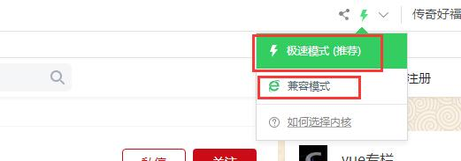
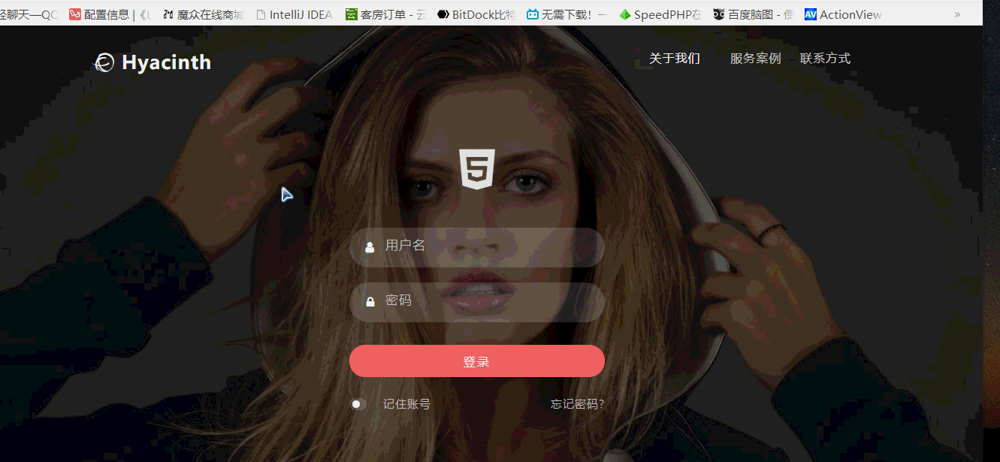
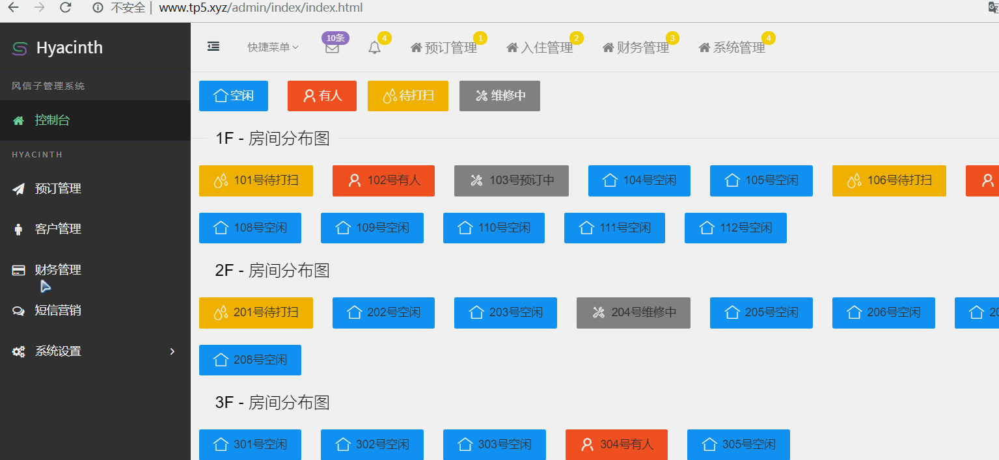
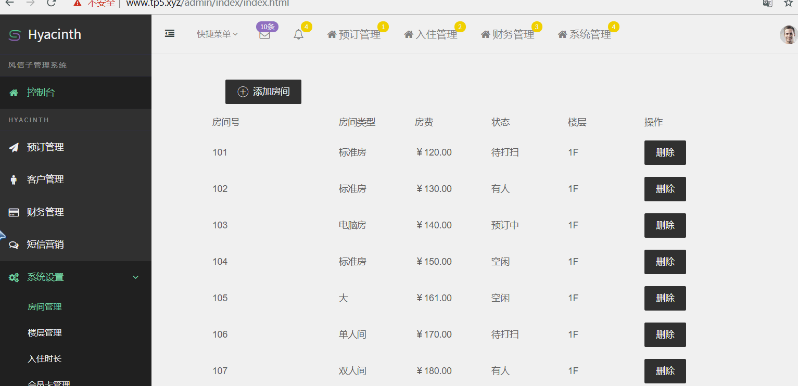
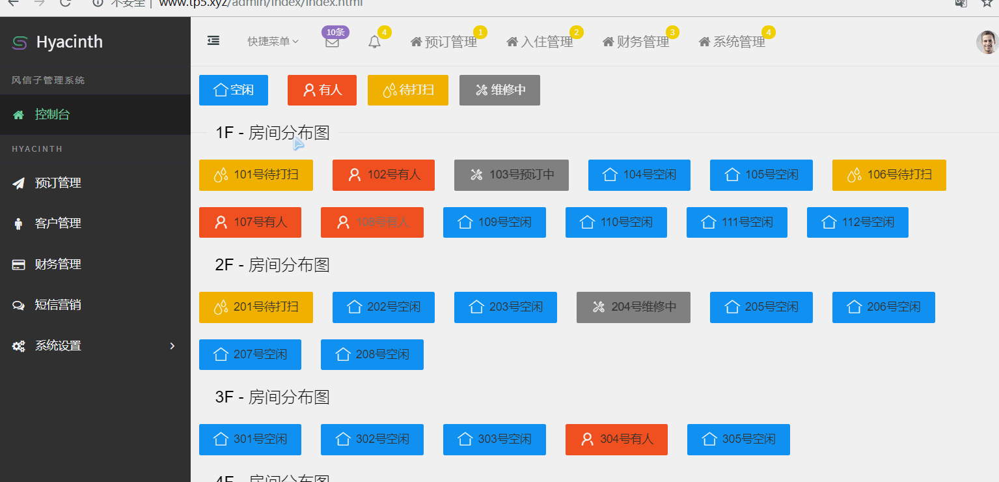
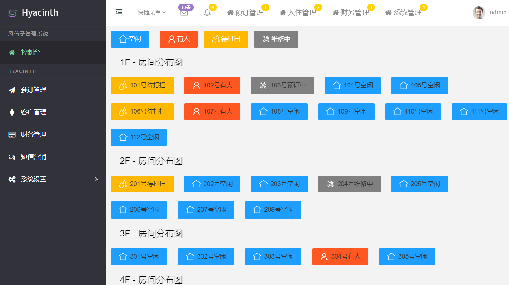
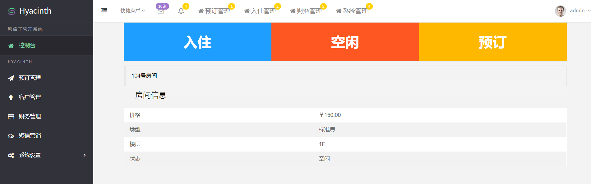
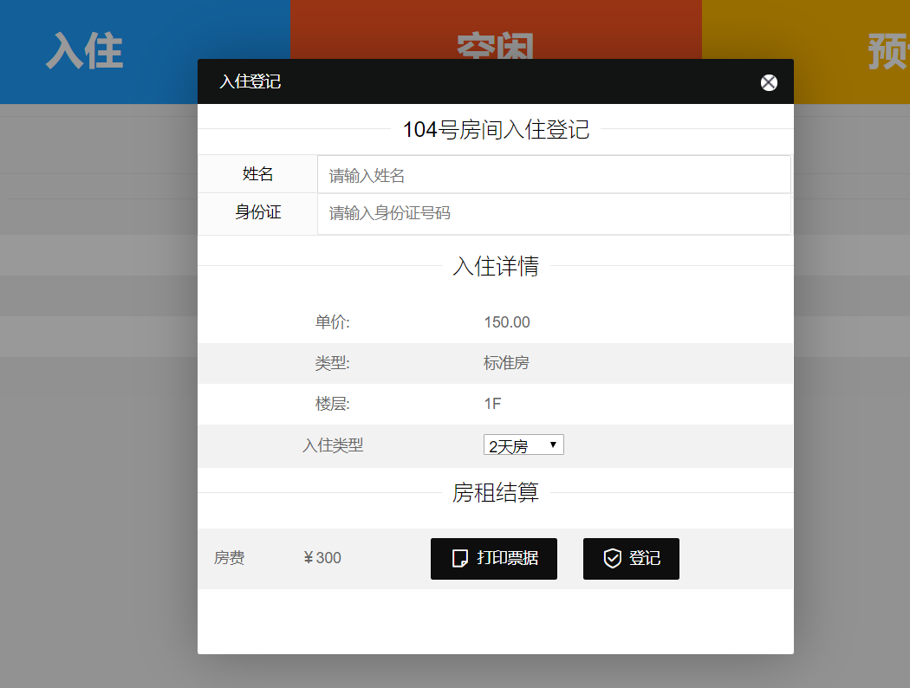
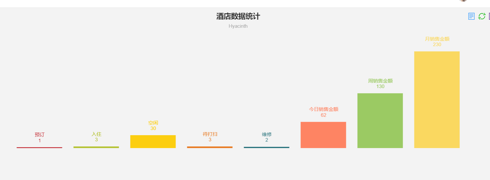
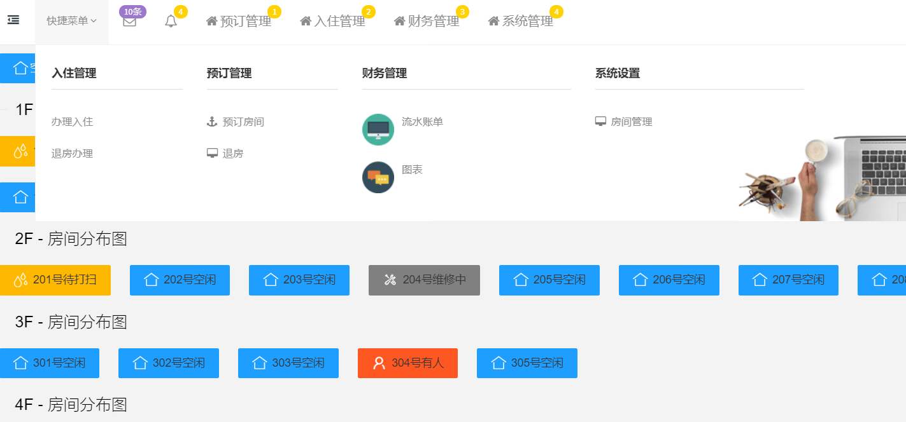

# Hyacinth

## 酒店民宿管理系统beta版


### ==不支持IE浏览器==
 


## 在线地址 

- [演示地址1](http://148.70.120.105:8001/admin/login/index )
- [演示地址2](http://148.70.120.105:8004/admin/login/index )


类型| 账号 | 密码
---|---|---
管理员|admin | 12345

==注: 数据库 在 public 目录下 wms.sql==


---


## 安装视频教程

[立即观看教程](https://www.bilibili.com/video/av80494498)

https://www.bilibili.com/video/av80494498

---

## 数据库配置文件
==/config/database.php==

```
return [
    // 数据库类型
    'type'            => 'mysql',
    // 服务器地址
    'hostname'        => '127.0.0.1',
    // 数据库名
    'database'        => 'wms',
    // 用户名
    'username'        => 'root',
    // 密码
    'password'        => 'root',
];
```


## qq群：285067592

<div  align="center">    
  
</div>


## 演示

















#-----------------------------------------------------------------------------------------------------

# 酒店系统新版本开发中

ThinkPHP 6.0版酒店管理系统开发中。。。
==============================
新版本对系统架构做了进一步的改进，其主要特性包括：

 + 入住管理
 + 预订管理
 + 语音提示、语音播报
 + 房态实时图表数据
 + 预警提示
 + 微信api接口
 + 短信营销
 + 会员管理
 + 酒店的商品管理
 + 报表中心
 + 财务管理
 + 设备管理。智能门锁、读卡器、身份证识别
 + 第三方平台接入：如：途牛、携程、飞猪

> 系统的运行环境要求PHP5.6以上。

## 仓库地址在线地址 


https://gitee.com/bool1993_admin/xenon-wms
